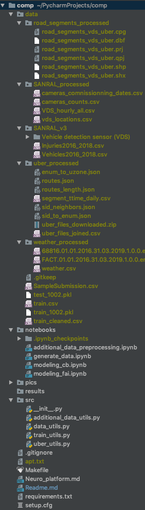
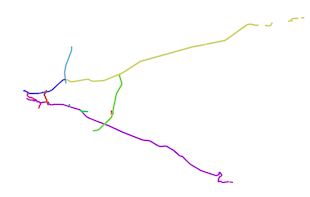

# [Uber Movement SANRAL Cape Town Challenge](https://zindi.africa/competitions/uber-movement-sanral-cape-town-challenge)

# INSTRUCTION for reproducing 2nd place solution (team: gusi-lebedi).

1. [Download](https://drive.google.com/file/d/19opUsM8CM-qKS36fJI5Ag0yt41dmWQdO/view?usp=sharing) 
base datasets and files collected and processed by us.
Unzip and put this folder in the root of project folder.
To see how we generated these files you can run  `notebooks/additional_data_preprocessing.ipynb`
(see `data exploration` section below for more details).

2. Having all needed files, you can generate `train*.pkl` and `test*.pkl`
using `notebooks/generate_data.ipynb` or you can just download it:
[train - 7 GB](https://drive.google.com/open?id=1EusjFyuG6HuXhVZXVJRIQDxM8CcMFMFV),
[test - 0.8 GB](https://drive.google.com/open?id=1-DCm1D41SXFtOoK45WxbCKEVwNZMWL03).
You can verify that the data in the tables doesn't contain data leaks and
data from datasets that aren't available to other participants. Please, store
them as `data/train*.pkl` and `data/test*.pkl`.

3. Having `train*.pkl` and `test*.pkl` use `notebooks/modelling_fai.ipynb` 
to train neural network and reproduce our submit. NOTE! For reproducing our results exactly please 
set PYTHONHASHSEED before running notebook. So, the start command should look like this:
`env PYTHONHASHSEED=42 jupyter notebook`.

Resulting folder structure should look like this:

Please, don't pay attention to `Makefile`, `setup.cfg`, `apt.txt`,
and `Neuro.md`, we used them only for working with our GPU cloud.

# DATA EXPLORATION
Let's discuss exactly what data we used and how we processed
it in `notebooks/additional_data_preprocessing.ipynb`.

In our solution we used base data (`train.csv`, `road_segments` and `Sanral_v3`)
and also we used additional data
shared between all participants (`Weather Data`, `Public holidays` and `Uber Movement Data`).
Note, that we didnt't use 
data leak which was found in `Injuries*.csv` and `Vehicles*.csv`.
We marked additional or modified files and directories with `_processed` suffix in their names.

### SANRAL
Folder: `data/SANRAL_processed`.

We automatically assigned each `CCTV`, `VDS` and `VMS` to the nearest road segment and then counted number 
of assigned cameras for each road segment - `cameras_count.csv`. 

Also we convert original `SANRAL` data to more usefull format:
* `cameras_commissioning_dates.csv` based on 
`Commissioning Date` column from `VDS_locations.xlsx`.
* `vds_locations.csv` is the second sheet of `SANRAL_V3/VDS_locations.xlsx` with handled missing records.
* `VDS_hourly_all.csv` is concatenation of all hourly files from `SANRAL_V3/Vehicle detection sensor (VDS)/[2016-2019]`.

### Road segments
Folder: `data/road_segments_processed`.

We opened shapefiles and their attribute table in `QGis` (free programm for viewing geo files) and 
enriched them with 3 new columns:
1. `main_route` - we assigned each road segment to long part of road named `route#` (see image below).
2. `vds_id` - the neareast VDS camera id to the road segment.
3. `num` - the enumerate id of the road segment.

### Weather
Folder: `data/weather_processed`.

We downloaded 2 airport weather files 
(`68816.01.01.2016.31.03.2019.1.0.0.en.utf8.00000000.csv` and 
`FACT.01.01.2016.31.03.2019.1.0.0.en.utf8.00000000.csv`)
 from provided site and combined them into 1 table with small preprocessing
(see `weather.csv` folder).

### Clean train.csv
We found that some accidents have only day indicator (with missing hour), so we decided to fill this 
missing values with hours taken from `Injures*.csv` / `Vehicles.csv` files. As a result we replaced roughly
1500 records and stored fixed table as `train_cleaned.csv`.
Please note, as in the `train.csv` there is only 2017-2018 year data, we didn't use the leak
from 2019 year.

### Uber data
Folder: `data/uber_processed/`

We downloaded a lot of files from
`Uber Movement` site provided by organizers (see `uber_files_downloaded.zip`).
Than we filtered and 
combined them into one large table - `uber_files_joined.csv`.

Since the travel time data is related to uber zones, we
manually created mapping between uber zones and road segments - `enum_to_uzone.json`.
In addition, we had to manually determine which road segments a car consistently
 crosses moving from one uber zone to another (`routes.json` and `sid_neighbors.json`).
 
For convenience, we store lengths of segments in `routes_length.json` and 
replaced all road segment names with numbers (`sid_to_enum.json`) using
`num` column from shapefile from the previous step. As a result we got the average travel times in
submit format: for each road segment for each timestamp - `segment_ttime_daily.csv`.

# MODEL OVERVIEW

Training model is much simpler than feature engineering: we trained single neural network 
(we used `fastai` framework for this purpose) without
any ensembling with 1-fold local validation.

* To train the model you have to run `notebooks/modeling_fai.ipynb`, it requires `train*.pkl` 
and `test*.pkl` as inputs,
generated (or downloaded) on the previous step. As an output, this will give the 
submit file and the model weights.
Estimated time of 1 attempt of model training on nvidia-tesla k80 is about 30 min.
